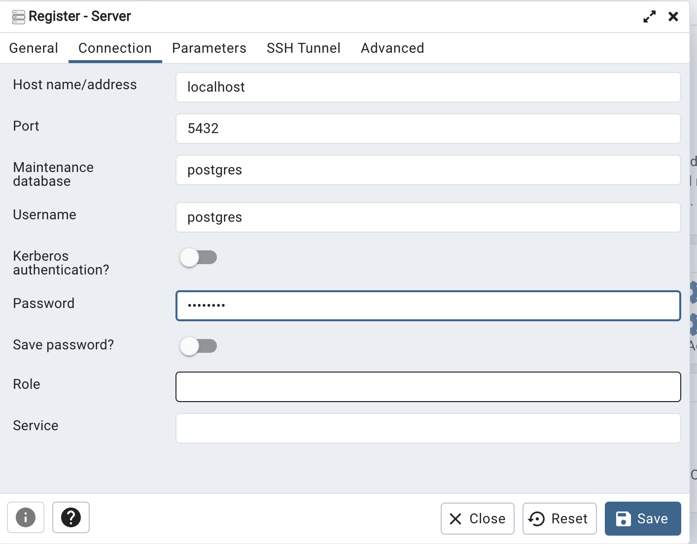

# Local Development

## Database
### Download the postgres database
[Postgres download link](https://www.postgresql.org/download/macosx/)  

set a password that will be used on database creation

| Variable | Value|
| ------------- | ------------- |
| password  | password  |
| host  | localhost  |
| port  | 5432  |
| server  | subtunes  |
| database  | subtunes  |

Install postgres and open pgAdmin 4  

  

### Create the Database
Add a new server and create a database named subtunes

  

- set the database
- set the host 
- set the port 
- set the password

  

### Initialize the Database

In a seperate terminal, from the home directory, run the following commands

``` flask --app api/index db init ```

``` flask --app api/index db revision --autogenerate -m "init db" ```

``` flask --app api/index db upgrade ```

This should create the schemas necessary for the subtunes application.

### Updating the schema
When the schema needs updating, or a new schema is added, attempt tot revise the database and upgrade it. if it does not work, delete the migration folder and run the above steps. 
If error talking about a "migration version does not exist", delete alembic_version table in the postgres db